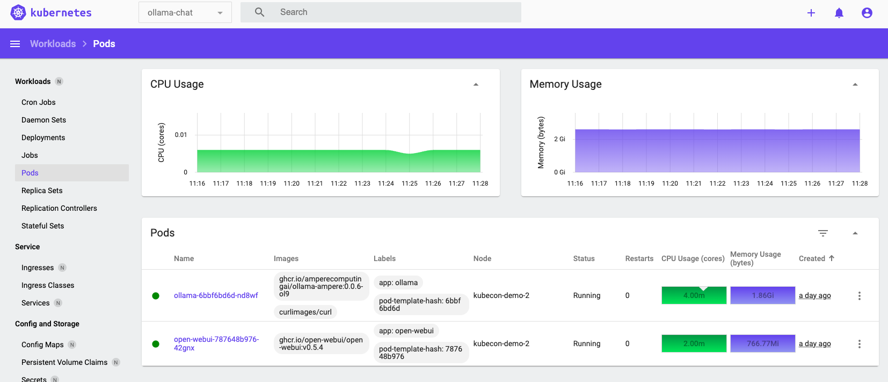
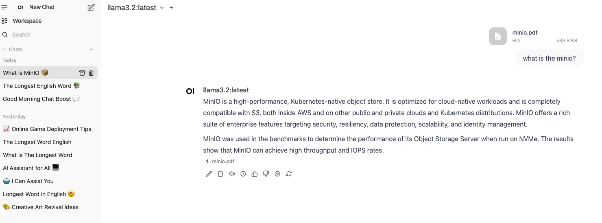

Ollama is a platform that enables users to run large language models (LLMs) locally on their machines. It provides tools to download, manage, and interact with various open-source LLMs, facilitating tasks such as text generation and chat-based applications.

# ollama-chat on Ampere processors
## Prepare and Deploy Single Node Microk8s (Ubuntu 22.04)
#### 1. Update Ubuntu OS
```sudo apt update && sudo apt upgrade -y```

#### 2. Install MicroK8s from snap on your system
```sudo snap install microk8s --channel=1.31-strict/stable```

#### 3. Check the instance 'microk8s is running'
```sudo microk8s status --wait-ready | head -n4```

#### 4. Add your user to the ‘microk8s’ group for unprivileged access on your system
```sudo adduser $USER snap_microk8s```

#### 5. Alias kubectl so it interacts with MicroK8s by default on your system
```sudo snap alias microk8s.kubectl kubectl```

#### 6. Create new group 
```newgrp snap_microk8s```

#### 7. Check the node status, run kubectl get node on your system
```kubectl get node -owide```

#### 8. Enable add-ons dns, hostpath-storage, ingress, dashboard
```
sudo microk8s enable hostpath-storage ingress
sudo microk8s enable dashboard
```

#### 9. Check the status to see if dns, hostpath-storage, ingress, dashboard are enabled
```sudo microk8s status```

#### 10. Show running pods
```kubectl get pod -A```

#### 11. Apply dashboard-ingress.yaml
*Note:*  
*Replace "your dashboard dns name" with your dns.*
*If you don't have dns name, you can set local dns as followed in the section "Run Demo using Local DNS"*       

```kubectl apply -f dashboard-ingress.yaml``` 

#### 12. Check to see if ingress is created and using the correct "dashboard dns name"
```kubectl get ingress -A```

#### 13. Retrieve token to access the Kubernetes dashboard
```sudo microk8s kubectl describe secret -n kube-system microk8s-dashboard-token```

#### 14. Acess your dashboard webUI via http://use.your.dns.name

#### 15. Enter the token you created in the previous step to login the Kubernetes Dashboard



## Deploy Ollama-chat Demo
#### 1. Create ollama-chat namespace
```kubectl create namespace ollama-chat```

#### 2. Download deployment.yaml, ingress.yaml, namespace.yaml, pvc.yaml, services.yaml into a folder to deploy Ollama-chat Demo
*Note: use your dns name in the ingress.yaml file*

```cd <folder you create which have these yaml files deployment.yaml, ingress.yaml, namespace.yaml, pvc.yaml, services.yaml>```

#### 3. Apply the yaml files you just downloaded.
```kubectl apply -f ./ -n ollama-chat```

#### Demo UI




# Run Demo using Local DNS Names

#### 1. Install the Lighter Display Manager for Ubuntu Desktop.
There are many of diferent desktop environment which you can choose to install for the ubuntu Desktop.  Here I choose
Lighter Display Manager which can be faster.
```sudo apt install lightdm -y```
##### Select *LightDM* when prompted.  If not prompted, switch manually:
```sudo dpkg-reconfigure lightdm```
##### Restart the setup
```sudo reboot```
